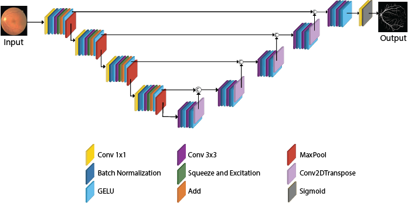

# iResSENet

This repository contains the original implementation of "iResSENet: An Accurate Convolutional Neural Network for Retinal Blood Vessel Segmentation".
- Email: phprogga@gmail.com


## 🔗 Paper
This code implements the paper:
>Progga, P.H., Shatabda, S. (2023). iResSENet: An Accurate Convolutional Neural Network for Retinal Blood Vessel Segmentation. In Neural Information Processing. ICONIP 2022. Lecture Notes in Computer Science, vol 13625. Springer, Cham. https://doi.org/10.1007/978-3-031-30111-7_48

If you find this work is helpful for your research, please cite our paper [[PDF](https://doi.org/10.1007/978-3-031-30111-7_48)].

* [View the Preprint ](https://www.researchgate.net/publication/370303865_iResSENet_An_Accurate_Convolutional_Neural_Network_for_Retinal_Blood_Vessel_Segmentation?utm_source=twitter&rgutm_meta1=eHNsLWRRZmNuT3VHam5Ua3kwTHN1TTBBaUFUdnErbm9weWlLZFJKWHA4Nlh3K1ZucHpmcW8zVTZIbzM4cHRVRVdlQTFnSkd5VnptVktCRGppNE5HUDJYVEptTT0%3D )

## 🔗 Copying
We share this code only for research use. If you find any problem or inappropriate content in this code, feel free to contact.
## 🔗 Use
### 1. Data Preparation
Download the Retinal datasets and their masks: DRIVE ([Link](https://drive.grand-challenge.org/)), CHASE_DB1 ([Link](https://blogs.kingston.ac.uk/retinal/chasedb1/)), HRF ([Link](https://www5.cs.fau.de/research/data/fundus-images/)) and STARE ([Link](https://cecas.clemson.edu/~ahoover/stare/)). 

For augmenation, you can check [DRIVE.ipynb](https://github.com/promaprogga/iResSENet-An-Accurate-Convolutional-Neural-Network-for-Retinal-Blood-Vessel-Segmentation/blob/main/DRIVE.ipynb).
### 2. Model and Evaluation
iResSENet, a novel deep learning-based architecture based on U-Net architecture. The proposed method enhances U-Net in three aspects. It replaces the encoder blocks with residual connections in addition to 1×1 convolutional layers and channel-based attention. 
Architecture:
<div style="text-align:center">
    
</div>

A demo can be found in [here](https://github.com/promaprogga/iResSENet-An-Accurate-Convolutional-Neural-Network-for-Retinal-Blood-Vessel-Segmentation/blob/main/DRIVE.ipynb) (tensorflow)


## 🔗 Citation Request
If you use 'iResSENet' in your project, please cite the following paper-
```
@inproceedings{progga2023iressenet,
  title={iResSENet: An Accurate Convolutional Neural Network for Retinal Blood Vessel Segmentation},
  author={Progga, Proma Hossain and Shatabda, Swakkhar},
  booktitle={Neural Information Processing: 29th International Conference, ICONIP 2022, Virtual Event, November 22--26, 2022, Proceedings, Part III},
  pages={567--578},
  year={2023},
  organization={Springer}
}
```

